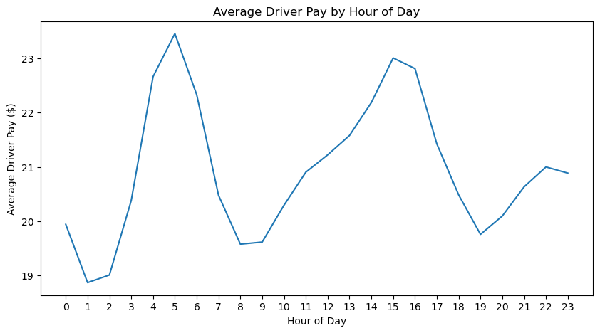

```python
import matplotlib
import matplotlib.pyplot as plt
import pandas as pd
import seaborn as sns
import pyarrow.parquet as pq      # for reading parquet file

%matplotlib inline

pd.set_option('display.max_columns', None)
```

# Objectives of the analysis:

**Research Question:** How does the timing of rides influence trip characteristics (distance, duration, fare) and driver earnings? 
 

**Hypothesis: Rides during peak hours are shorter in distance but have higher fares and driver earnings due to increased demand and congestion, while off-peak rides are longer but less profitable per mile.s

**Assumption: 
Fare: The fares for rides are primarily influenced by base fare structures, surge pricing, and tolls. 
Congestion and demand: It is assumed that higher fares during peak hours reflect both the congestion and increased demand, which could be inferred from trip duration and distance during those times.t.

**Significance:*"


# For my analysis I am using "High Volume For-Hire Vehicle Trip Records for October 2024"
The reason behind choosing this dataset is to analyze trips during a common month of the previous year & because October doesn't have much holidays and school/offices runs on regular schedule we could see how vehicle trips are effected by certain factors

## Some description of the dataset
:> The High Volume For-Hire Vehicle (HVFHV) trip data represents trips dispatched by large rideshare services like Uber and Lyft, which operate under a special license in NYC.

**Key Points:**

    - Each row = One trip taken in an HVFHV (Uber, Lyft, etc.).
    - Local Law 149 of 2018 created a new license category for companies that dispatch 10,000+ trips per day.
    - The law took effect on February 1, 2019, meaning data before this date might not exist for this category.

**The description of the dataset can be found here:** https://www.nyc.gov/assets/tlc/downloads/pdf/data_dictionary_trip_records_hvfhs.pdf


# Data Cleaning


```python
# loading data 
trips = pq.read_table('fhvhv_tripdata_2024-10.parquet')
trips = trips.to_pandas()

trips.head()
```


<div>
<style scoped>
    .dataframe tbody tr th:only-of-type {
        vertical-align: middle;
    }

    .dataframe tbody tr th {
        vertical-align: top;
    }

    .dataframe thead th {
        text-align: right;
    }
</style>
<table border="1" class="dataframe">
  <thead>
    <tr style="text-align: right;">
      <th></th>
      <th>hvfhs_license_num</th>
      <th>dispatching_base_num</th>
      <th>originating_base_num</th>
      <th>request_datetime</th>
      <th>on_scene_datetime</th>
      <th>pickup_datetime</th>
      <th>dropoff_datetime</th>
      <th>PULocationID</th>
      <th>DOLocationID</th>
      <th>trip_miles</th>
      <th>trip_time</th>
      <th>base_passenger_fare</th>
      <th>tolls</th>
      <th>bcf</th>
      <th>sales_tax</th>
      <th>congestion_surcharge</th>
      <th>airport_fee</th>
      <th>tips</th>
      <th>driver_pay</th>
      <th>shared_request_flag</th>
      <th>shared_match_flag</th>
      <th>access_a_ride_flag</th>
      <th>wav_request_flag</th>
      <th>wav_match_flag</th>
    </tr>
  </thead>
  <tbody>
    <tr>
      <th>0</th>
      <td>HV0003</td>
      <td>B03404</td>
      <td>B03404</td>
      <td>2024-10-01 00:35:45</td>
      <td>2024-10-01 00:38:27</td>
      <td>2024-10-01 00:39:44</td>
      <td>2024-10-01 00:50:13</td>
      <td>161</td>
      <td>148</td>
      <td>2.92</td>
      <td>629</td>
      <td>18.72</td>
      <td>0.0</td>
      <td>0.54</td>
      <td>1.77</td>
      <td>2.75</td>
      <td>0.0</td>
      <td>0.0</td>
      <td>10.08</td>
      <td>N</td>
      <td>N</td>
      <td>N</td>
      <td>N</td>
      <td>N</td>
    </tr>
    <tr>
      <th>1</th>
      <td>HV0003</td>
      <td>B03404</td>
      <td>B03404</td>
      <td>2024-10-01 00:47:18</td>
      <td>2024-10-01 00:51:47</td>
      <td>2024-10-01 00:54:57</td>
      <td>2024-10-01 01:06:18</td>
      <td>148</td>
      <td>87</td>
      <td>2.09</td>
      <td>681</td>
      <td>42.34</td>
      <td>0.0</td>
      <td>1.24</td>
      <td>4.00</td>
      <td>2.75</td>
      <td>0.0</td>
      <td>0.0</td>
      <td>25.35</td>
      <td>N</td>
      <td>N</td>
      <td>N</td>
      <td>N</td>
      <td>N</td>
    </tr>
    <tr>
      <th>2</th>
      <td>HV0003</td>
      <td>B03404</td>
      <td>B03404</td>
      <td>2024-10-01 00:02:57</td>
      <td>2024-10-01 00:04:48</td>
      <td>2024-10-01 00:05:02</td>
      <td>2024-10-01 00:12:00</td>
      <td>17</td>
      <td>49</td>
      <td>1.55</td>
      <td>418</td>
      <td>10.74</td>
      <td>0.0</td>
      <td>0.29</td>
      <td>0.96</td>
      <td>0.00</td>
      <td>0.0</td>
      <td>0.0</td>
      <td>6.17</td>
      <td>N</td>
      <td>N</td>
      <td>N</td>
      <td>N</td>
      <td>N</td>
    </tr>
    <tr>
      <th>3</th>
      <td>HV0003</td>
      <td>B03404</td>
      <td>B03404</td>
      <td>2024-10-01 00:44:39</td>
      <td>2024-10-01 00:47:12</td>
      <td>2024-10-01 00:47:18</td>
      <td>2024-10-01 01:04:48</td>
      <td>106</td>
      <td>79</td>
      <td>4.23</td>
      <td>1050</td>
      <td>20.36</td>
      <td>0.0</td>
      <td>0.60</td>
      <td>1.92</td>
      <td>2.75</td>
      <td>0.0</td>
      <td>0.0</td>
      <td>15.95</td>
      <td>N</td>
      <td>N</td>
      <td>N</td>
      <td>N</td>
      <td>N</td>
    </tr>
    <tr>
      <th>4</th>
      <td>HV0003</td>
      <td>B03404</td>
      <td>B03404</td>
      <td>2024-10-01 00:07:01</td>
      <td>2024-10-01 00:12:16</td>
      <td>2024-10-01 00:12:46</td>
      <td>2024-10-01 00:23:55</td>
      <td>198</td>
      <td>37</td>
      <td>1.91</td>
      <td>669</td>
      <td>11.36</td>
      <td>0.0</td>
      <td>0.33</td>
      <td>1.07</td>
      <td>0.00</td>
      <td>0.0</td>
      <td>0.0</td>
      <td>9.27</td>
      <td>N</td>
      <td>N</td>
      <td>N</td>
      <td>N</td>
      <td>N</td>
    </tr>
  </tbody>
</table>
</div>


```python
trips.tail()
```


<div>
<style scoped>
    .dataframe tbody tr th:only-of-type {
        vertical-align: middle;
    }

    .dataframe tbody tr th {
        vertical-align: top;
    }

    .dataframe thead th {
        text-align: right;
    }
</style>
<table border="1" class="dataframe">
  <thead>
    <tr style="text-align: right;">
      <th></th>
      <th>hvfhs_license_num</th>
      <th>dispatching_base_num</th>
      <th>originating_base_num</th>
      <th>request_datetime</th>
      <th>on_scene_datetime</th>
      <th>pickup_datetime</th>
      <th>dropoff_datetime</th>
      <th>PULocationID</th>
      <th>DOLocationID</th>
      <th>trip_miles</th>
      <th>trip_time</th>
      <th>base_passenger_fare</th>
      <th>tolls</th>
      <th>bcf</th>
      <th>sales_tax</th>
      <th>congestion_surcharge</th>
      <th>airport_fee</th>
      <th>tips</th>
      <th>driver_pay</th>
      <th>shared_request_flag</th>
      <th>shared_match_flag</th>
      <th>access_a_ride_flag</th>
      <th>wav_request_flag</th>
      <th>wav_match_flag</th>
    </tr>
  </thead>
  <tbody>
    <tr>
      <th>20028277</th>
      <td>HV0003</td>
      <td>B03404</td>
      <td>B03404</td>
      <td>2024-10-31 23:07:39</td>
      <td>2024-10-31 23:11:09</td>
      <td>2024-10-31 23:11:16</td>
      <td>2024-10-31 23:30:13</td>
      <td>170</td>
      <td>186</td>
      <td>2.07</td>
      <td>1137</td>
      <td>17.08</td>
      <td>0.0</td>
      <td>0.49</td>
      <td>1.60</td>
      <td>2.75</td>
      <td>0.0</td>
      <td>0.00</td>
      <td>15.12</td>
      <td>N</td>
      <td>N</td>
      <td>N</td>
      <td>N</td>
      <td>N</td>
    </tr>
    <tr>
      <th>20028278</th>
      <td>HV0003</td>
      <td>B03404</td>
      <td>B03404</td>
      <td>2024-10-31 23:27:07</td>
      <td>2024-10-31 23:40:33</td>
      <td>2024-10-31 23:41:38</td>
      <td>2024-11-01 00:24:09</td>
      <td>234</td>
      <td>49</td>
      <td>5.53</td>
      <td>2551</td>
      <td>37.55</td>
      <td>0.0</td>
      <td>1.10</td>
      <td>3.55</td>
      <td>2.75</td>
      <td>0.0</td>
      <td>0.00</td>
      <td>33.81</td>
      <td>N</td>
      <td>N</td>
      <td>N</td>
      <td>N</td>
      <td>N</td>
    </tr>
    <tr>
      <th>20028279</th>
      <td>HV0003</td>
      <td>B03404</td>
      <td>B03404</td>
      <td>2024-10-31 23:15:26</td>
      <td>2024-10-31 23:20:21</td>
      <td>2024-10-31 23:20:34</td>
      <td>2024-10-31 23:58:32</td>
      <td>231</td>
      <td>263</td>
      <td>8.79</td>
      <td>2278</td>
      <td>42.28</td>
      <td>0.0</td>
      <td>1.16</td>
      <td>3.76</td>
      <td>2.75</td>
      <td>0.0</td>
      <td>0.00</td>
      <td>37.42</td>
      <td>N</td>
      <td>N</td>
      <td>N</td>
      <td>N</td>
      <td>N</td>
    </tr>
    <tr>
      <th>20028280</th>
      <td>HV0003</td>
      <td>B03404</td>
      <td>B03404</td>
      <td>2024-10-31 23:14:44</td>
      <td>2024-10-31 23:16:36</td>
      <td>2024-10-31 23:17:02</td>
      <td>2024-10-31 23:25:38</td>
      <td>249</td>
      <td>186</td>
      <td>1.36</td>
      <td>516</td>
      <td>26.10</td>
      <td>0.0</td>
      <td>0.72</td>
      <td>2.32</td>
      <td>2.75</td>
      <td>0.0</td>
      <td>6.37</td>
      <td>13.13</td>
      <td>N</td>
      <td>N</td>
      <td>N</td>
      <td>N</td>
      <td>N</td>
    </tr>
    <tr>
      <th>20028281</th>
      <td>HV0003</td>
      <td>B03404</td>
      <td>B03404</td>
      <td>2024-10-31 23:25:49</td>
      <td>2024-10-31 23:32:08</td>
      <td>2024-10-31 23:32:17</td>
      <td>2024-11-01 00:03:08</td>
      <td>186</td>
      <td>265</td>
      <td>6.22</td>
      <td>1851</td>
      <td>33.30</td>
      <td>20.0</td>
      <td>0.92</td>
      <td>0.00</td>
      <td>0.00</td>
      <td>0.0</td>
      <td>5.42</td>
      <td>30.81</td>
      <td>N</td>
      <td>N</td>
      <td>N</td>
      <td>N</td>
      <td>N</td>
    </tr>
  </tbody>
</table>
</div>


```python
# Mapping app company names by 'hvfhs_license_num' column

mapping = {
    'HV0002': 'Juno',
    'HV0003': 'Uber',
    'HV0004': 'Via',
    'HV0005': 'Lyft'
}

trips.insert(1, 'app_company', trips['hvfhs_license_num'].map(mapping))

trips.head()

```


<div>
<style scoped>
    .dataframe tbody tr th:only-of-type {
        vertical-align: middle;
    }

    .dataframe tbody tr th {
        vertical-align: top;
    }

    .dataframe thead th {
        text-align: right;
    }
</style>
<table border="1" class="dataframe">
  <thead>
    <tr style="text-align: right;">
      <th></th>
      <th>hvfhs_license_num</th>
      <th>app_company</th>
      <th>dispatching_base_num</th>
      <th>originating_base_num</th>
      <th>request_datetime</th>
      <th>on_scene_datetime</th>
      <th>pickup_datetime</th>
      <th>dropoff_datetime</th>
      <th>PULocationID</th>
      <th>DOLocationID</th>
      <th>trip_miles</th>
      <th>trip_time</th>
      <th>base_passenger_fare</th>
      <th>tolls</th>
      <th>bcf</th>
      <th>sales_tax</th>
      <th>congestion_surcharge</th>
      <th>airport_fee</th>
      <th>tips</th>
      <th>driver_pay</th>
      <th>shared_request_flag</th>
      <th>shared_match_flag</th>
      <th>access_a_ride_flag</th>
      <th>wav_request_flag</th>
      <th>wav_match_flag</th>
    </tr>
  </thead>
  <tbody>
    <tr>
      <th>0</th>
      <td>HV0003</td>
      <td>Uber</td>
      <td>B03404</td>
      <td>B03404</td>
      <td>2024-10-01 00:35:45</td>
      <td>2024-10-01 00:38:27</td>
      <td>2024-10-01 00:39:44</td>
      <td>2024-10-01 00:50:13</td>
      <td>161</td>
      <td>148</td>
      <td>2.92</td>
      <td>629</td>
      <td>18.72</td>
      <td>0.0</td>
      <td>0.54</td>
      <td>1.77</td>
      <td>2.75</td>
      <td>0.0</td>
      <td>0.0</td>
      <td>10.08</td>
      <td>N</td>
      <td>N</td>
      <td>N</td>
      <td>N</td>
      <td>N</td>
    </tr>
    <tr>
      <th>1</th>
      <td>HV0003</td>
      <td>Uber</td>
      <td>B03404</td>
      <td>B03404</td>
      <td>2024-10-01 00:47:18</td>
      <td>2024-10-01 00:51:47</td>
      <td>2024-10-01 00:54:57</td>
      <td>2024-10-01 01:06:18</td>
      <td>148</td>
      <td>87</td>
      <td>2.09</td>
      <td>681</td>
      <td>42.34</td>
      <td>0.0</td>
      <td>1.24</td>
      <td>4.00</td>
      <td>2.75</td>
      <td>0.0</td>
      <td>0.0</td>
      <td>25.35</td>
      <td>N</td>
      <td>N</td>
      <td>N</td>
      <td>N</td>
      <td>N</td>
    </tr>
    <tr>
      <th>2</th>
      <td>HV0003</td>
      <td>Uber</td>
      <td>B03404</td>
      <td>B03404</td>
      <td>2024-10-01 00:02:57</td>
      <td>2024-10-01 00:04:48</td>
      <td>2024-10-01 00:05:02</td>
      <td>2024-10-01 00:12:00</td>
      <td>17</td>
      <td>49</td>
      <td>1.55</td>
      <td>418</td>
      <td>10.74</td>
      <td>0.0</td>
      <td>0.29</td>
      <td>0.96</td>
      <td>0.00</td>
      <td>0.0</td>
      <td>0.0</td>
      <td>6.17</td>
      <td>N</td>
      <td>N</td>
      <td>N</td>
      <td>N</td>
      <td>N</td>
    </tr>
    <tr>
      <th>3</th>
      <td>HV0003</td>
      <td>Uber</td>
      <td>B03404</td>
      <td>B03404</td>
      <td>2024-10-01 00:44:39</td>
      <td>2024-10-01 00:47:12</td>
      <td>2024-10-01 00:47:18</td>
      <td>2024-10-01 01:04:48</td>
      <td>106</td>
      <td>79</td>
      <td>4.23</td>
      <td>1050</td>
      <td>20.36</td>
      <td>0.0</td>
      <td>0.60</td>
      <td>1.92</td>
      <td>2.75</td>
      <td>0.0</td>
      <td>0.0</td>
      <td>15.95</td>
      <td>N</td>
      <td>N</td>
      <td>N</td>
      <td>N</td>
      <td>N</td>
    </tr>
    <tr>
      <th>4</th>
      <td>HV0003</td>
      <td>Uber</td>
      <td>B03404</td>
      <td>B03404</td>
      <td>2024-10-01 00:07:01</td>
      <td>2024-10-01 00:12:16</td>
      <td>2024-10-01 00:12:46</td>
      <td>2024-10-01 00:23:55</td>
      <td>198</td>
      <td>37</td>
      <td>1.91</td>
      <td>669</td>
      <td>11.36</td>
      <td>0.0</td>
      <td>0.33</td>
      <td>1.07</td>
      <td>0.00</td>
      <td>0.0</td>
      <td>0.0</td>
      <td>9.27</td>
      <td>N</td>
      <td>N</td>
      <td>N</td>
      <td>N</td>
      <td>N</td>
    </tr>
  </tbody>
</table>
</div>


```python
# data types of different variable of the dataset
trips.dtypes
```


    hvfhs_license_num               object
    app_company                     object
    dispatching_base_num            object
    originating_base_num            object
    request_datetime        datetime64[us]
    on_scene_datetime       datetime64[us]
    pickup_datetime         datetime64[us]
    dropoff_datetime        datetime64[us]
    PULocationID                     int32
    DOLocationID                     int32
    trip_miles                     float64
    trip_time                        int64
    base_passenger_fare            float64
    tolls                          float64
    bcf                            float64
    sales_tax                      float64
    congestion_surcharge           float64
    airport_fee                    float64
    tips                           float64
    driver_pay                     float64
    shared_request_flag             object
    shared_match_flag               object
    access_a_ride_flag              object
    wav_request_flag                object
    wav_match_flag                  object
    dtype: object


```python
# Just checking number of trips for uber vs Lyft
number_of_trips_by_company = trips['app_company'].value_counts()
number_of_trips_by_company.plot(kind = 'bar')
plt.title('Uber vs Lyft number of trips')
plt.xlabel('Ride Share Company')
plt.ylabel('Number of Trips')
```


    Text(0, 0.5, 'Number of Trips')


    

    


#### Uber does significantly more trips than Lyft suggesting uber is most popular among NYC passengers

## Just looking at lyft data separately


```python
lyft_trips = trips[~trips['app_company'].isin(['Uber'])]
lyft_trips.head(50)
```


<div>
<style scoped>
    .dataframe tbody tr th:only-of-type {
        vertical-align: middle;
    }

    .dataframe tbody tr th {
        vertical-align: top;
    }

    .dataframe thead th {
        text-align: right;
    }
</style>
<table border="1" class="dataframe">
  <thead>
    <tr style="text-align: right;">
      <th></th>
      <th>hvfhs_license_num</th>
      <th>app_company</th>
      <th>dispatching_base_num</th>
      <th>originating_base_num</th>
      <th>request_datetime</th>
      <th>on_scene_datetime</th>
      <th>pickup_datetime</th>
      <th>dropoff_datetime</th>
      <th>PULocationID</th>
      <th>DOLocationID</th>
      <th>trip_miles</th>
      <th>trip_time</th>
      <th>base_passenger_fare</th>
      <th>tolls</th>
      <th>bcf</th>
      <th>sales_tax</th>
      <th>congestion_surcharge</th>
      <th>airport_fee</th>
      <th>tips</th>
      <th>driver_pay</th>
      <th>shared_request_flag</th>
      <th>shared_match_flag</th>
      <th>access_a_ride_flag</th>
      <th>wav_request_flag</th>
      <th>wav_match_flag</th>
    </tr>
  </thead>
  <tbody>
    <tr>
      <th>9</th>
      <td>HV0005</td>
      <td>Lyft</td>
      <td>B03406</td>
      <td>None</td>
      <td>2024-10-01 00:33:45</td>
      <td>NaT</td>
      <td>2024-10-01 00:40:44</td>
      <td>2024-10-01 00:56:43</td>
      <td>102</td>
      <td>180</td>
      <td>3.404</td>
      <td>959</td>
      <td>18.12</td>
      <td>0.00</td>
      <td>0.44</td>
      <td>1.43</td>
      <td>0.00</td>
      <td>0.0</td>
      <td>0.00</td>
      <td>15.31</td>
      <td>N</td>
      <td>N</td>
      <td>N</td>
      <td>N</td>
      <td>Y</td>
    </tr>
    <tr>
      <th>21</th>
      <td>HV0005</td>
      <td>Lyft</td>
      <td>B03406</td>
      <td>None</td>
      <td>2024-10-01 00:07:12</td>
      <td>NaT</td>
      <td>2024-10-01 00:10:16</td>
      <td>2024-10-01 00:29:33</td>
      <td>143</td>
      <td>113</td>
      <td>4.091</td>
      <td>1157</td>
      <td>25.23</td>
      <td>0.00</td>
      <td>0.68</td>
      <td>2.21</td>
      <td>2.75</td>
      <td>0.0</td>
      <td>0.00</td>
      <td>17.75</td>
      <td>N</td>
      <td>N</td>
      <td>N</td>
      <td>N</td>
      <td>N</td>
    </tr>
    <tr>
      <th>24</th>
      <td>HV0005</td>
      <td>Lyft</td>
      <td>B03406</td>
      <td>None</td>
      <td>2024-10-01 00:10:49</td>
      <td>NaT</td>
      <td>2024-10-01 00:13:59</td>
      <td>2024-10-01 00:20:24</td>
      <td>61</td>
      <td>61</td>
      <td>1.045</td>
      <td>385</td>
      <td>9.67</td>
      <td>0.00</td>
      <td>0.24</td>
      <td>0.76</td>
      <td>0.00</td>
      <td>0.0</td>
      <td>0.00</td>
      <td>5.47</td>
      <td>N</td>
      <td>N</td>
      <td>N</td>
      <td>N</td>
      <td>N</td>
    </tr>
    <tr>
      <th>34</th>
      <td>HV0005</td>
      <td>Lyft</td>
      <td>B03406</td>
      <td>None</td>
      <td>2024-10-01 00:19:38</td>
      <td>NaT</td>
      <td>2024-10-01 00:22:12</td>
      <td>2024-10-01 00:48:11</td>
      <td>164</td>
      <td>252</td>
      <td>13.136</td>
      <td>1559</td>
      <td>40.78</td>
      <td>6.45</td>
      <td>1.30</td>
      <td>4.19</td>
      <td>2.75</td>
      <td>0.0</td>
      <td>8.32</td>
      <td>33.13</td>
      <td>N</td>
      <td>N</td>
      <td>N</td>
      <td>N</td>
      <td>N</td>
    </tr>
    <tr>
      <th>37</th>
      <td>HV0005</td>
      <td>Lyft</td>
      <td>B03406</td>
      <td>None</td>
      <td>2024-10-01 00:00:58</td>
      <td>NaT</td>
      <td>2024-10-01 00:04:55</td>
      <td>2024-10-01 00:08:15</td>
      <td>40</td>
      <td>33</td>
      <td>0.718</td>
      <td>200</td>
      <td>8.61</td>
      <td>0.00</td>
      <td>0.21</td>
      <td>0.68</td>
      <td>0.00</td>
      <td>0.0</td>
      <td>0.00</td>
      <td>5.47</td>
      <td>N</td>
      <td>N</td>
      <td>N</td>
      <td>N</td>
      <td>N</td>
    </tr>
    <tr>
      <th>38</th>
      <td>HV0005</td>
      <td>Lyft</td>
      <td>B03406</td>
      <td>None</td>
      <td>2024-10-01 00:22:47</td>
      <td>NaT</td>
      <td>2024-10-01 00:30:32</td>
      <td>2024-10-01 00:39:36</td>
      <td>33</td>
      <td>106</td>
      <td>2.355</td>
      <td>544</td>
      <td>11.63</td>
      <td>0.00</td>
      <td>0.32</td>
      <td>1.03</td>
      <td>0.00</td>
      <td>0.0</td>
      <td>2.00</td>
      <td>8.52</td>
      <td>N</td>
      <td>N</td>
      <td>N</td>
      <td>N</td>
      <td>N</td>
    </tr>
    <tr>
      <th>39</th>
      <td>HV0005</td>
      <td>Lyft</td>
      <td>B03406</td>
      <td>None</td>
      <td>2024-10-01 00:39:49</td>
      <td>NaT</td>
      <td>2024-10-01 00:42:42</td>
      <td>2024-10-01 00:50:36</td>
      <td>40</td>
      <td>181</td>
      <td>1.542</td>
      <td>474</td>
      <td>8.69</td>
      <td>0.00</td>
      <td>0.24</td>
      <td>0.77</td>
      <td>0.00</td>
      <td>0.0</td>
      <td>2.00</td>
      <td>6.73</td>
      <td>N</td>
      <td>N</td>
      <td>N</td>
      <td>N</td>
      <td>N</td>
    </tr>
    <tr>
      <th>51</th>
      <td>HV0005</td>
      <td>Lyft</td>
      <td>B03406</td>
      <td>None</td>
      <td>2024-10-01 00:18:42</td>
      <td>NaT</td>
      <td>2024-10-01 00:21:12</td>
      <td>2024-10-01 00:33:41</td>
      <td>225</td>
      <td>61</td>
      <td>2.087</td>
      <td>749</td>
      <td>12.40</td>
      <td>0.00</td>
      <td>0.30</td>
      <td>0.98</td>
      <td>0.00</td>
      <td>0.0</td>
      <td>0.00</td>
      <td>10.15</td>
      <td>N</td>
      <td>N</td>
      <td>N</td>
      <td>N</td>
      <td>N</td>
    </tr>
    <tr>
      <th>54</th>
      <td>HV0005</td>
      <td>Lyft</td>
      <td>B03406</td>
      <td>None</td>
      <td>2024-10-01 00:35:59</td>
      <td>NaT</td>
      <td>2024-10-01 00:39:27</td>
      <td>2024-10-01 00:54:53</td>
      <td>89</td>
      <td>228</td>
      <td>2.472</td>
      <td>926</td>
      <td>14.95</td>
      <td>0.00</td>
      <td>0.41</td>
      <td>1.33</td>
      <td>0.00</td>
      <td>0.0</td>
      <td>3.34</td>
      <td>12.40</td>
      <td>N</td>
      <td>N</td>
      <td>N</td>
      <td>N</td>
      <td>N</td>
    </tr>
    <tr>
      <th>69</th>
      <td>HV0005</td>
      <td>Lyft</td>
      <td>B03406</td>
      <td>None</td>
      <td>2024-09-30 23:57:20</td>
      <td>NaT</td>
      <td>2024-10-01 00:03:42</td>
      <td>2024-10-01 00:23:15</td>
      <td>138</td>
      <td>263</td>
      <td>7.911</td>
      <td>1173</td>
      <td>37.90</td>
      <td>6.77</td>
      <td>1.33</td>
      <td>4.51</td>
      <td>2.75</td>
      <td>2.5</td>
      <td>0.00</td>
      <td>23.95</td>
      <td>N</td>
      <td>N</td>
      <td>N</td>
      <td>N</td>
      <td>N</td>
    </tr>
    <tr>
      <th>70</th>
      <td>HV0005</td>
      <td>Lyft</td>
      <td>B03406</td>
      <td>None</td>
      <td>2024-10-01 00:06:25</td>
      <td>NaT</td>
      <td>2024-10-01 00:09:50</td>
      <td>2024-10-01 00:16:36</td>
      <td>61</td>
      <td>61</td>
      <td>0.992</td>
      <td>406</td>
      <td>8.95</td>
      <td>0.00</td>
      <td>0.25</td>
      <td>0.79</td>
      <td>0.00</td>
      <td>0.0</td>
      <td>0.00</td>
      <td>5.47</td>
      <td>N</td>
      <td>N</td>
      <td>N</td>
      <td>N</td>
      <td>N</td>
    </tr>
    <tr>
      <th>71</th>
      <td>HV0005</td>
      <td>Lyft</td>
      <td>B03406</td>
      <td>None</td>
      <td>2024-10-01 00:30:40</td>
      <td>NaT</td>
      <td>2024-10-01 00:34:38</td>
      <td>2024-10-01 00:54:33</td>
      <td>225</td>
      <td>145</td>
      <td>4.615</td>
      <td>1195</td>
      <td>22.32</td>
      <td>0.00</td>
      <td>0.61</td>
      <td>1.98</td>
      <td>0.00</td>
      <td>0.0</td>
      <td>0.00</td>
      <td>17.95</td>
      <td>N</td>
      <td>N</td>
      <td>N</td>
      <td>N</td>
      <td>N</td>
    </tr>
    <tr>
      <th>96</th>
      <td>HV0005</td>
      <td>Lyft</td>
      <td>B03406</td>
      <td>None</td>
      <td>2024-10-01 00:05:19</td>
      <td>NaT</td>
      <td>2024-10-01 00:09:13</td>
      <td>2024-10-01 00:21:14</td>
      <td>223</td>
      <td>126</td>
      <td>4.553</td>
      <td>721</td>
      <td>16.38</td>
      <td>6.87</td>
      <td>0.60</td>
      <td>1.95</td>
      <td>0.00</td>
      <td>0.0</td>
      <td>3.87</td>
      <td>13.24</td>
      <td>N</td>
      <td>N</td>
      <td>N</td>
      <td>N</td>
      <td>N</td>
    </tr>
    <tr>
      <th>97</th>
      <td>HV0005</td>
      <td>Lyft</td>
      <td>B03406</td>
      <td>None</td>
      <td>2024-10-01 00:18:36</td>
      <td>NaT</td>
      <td>2024-10-01 00:23:25</td>
      <td>2024-10-01 00:37:36</td>
      <td>126</td>
      <td>47</td>
      <td>2.260</td>
      <td>851</td>
      <td>14.17</td>
      <td>0.00</td>
      <td>0.39</td>
      <td>1.26</td>
      <td>0.00</td>
      <td>0.0</td>
      <td>0.00</td>
      <td>11.38</td>
      <td>N</td>
      <td>N</td>
      <td>N</td>
      <td>N</td>
      <td>N</td>
    </tr>
    <tr>
      <th>98</th>
      <td>HV0005</td>
      <td>Lyft</td>
      <td>B03406</td>
      <td>None</td>
      <td>2024-10-01 00:33:04</td>
      <td>NaT</td>
      <td>2024-10-01 00:39:04</td>
      <td>2024-10-01 00:57:54</td>
      <td>47</td>
      <td>242</td>
      <td>5.345</td>
      <td>1130</td>
      <td>20.59</td>
      <td>0.00</td>
      <td>0.57</td>
      <td>1.83</td>
      <td>0.00</td>
      <td>0.0</td>
      <td>0.00</td>
      <td>18.31</td>
      <td>N</td>
      <td>N</td>
      <td>N</td>
      <td>N</td>
      <td>N</td>
    </tr>
    <tr>
      <th>100</th>
      <td>HV0005</td>
      <td>Lyft</td>
      <td>B03406</td>
      <td>None</td>
      <td>2024-10-01 00:11:05</td>
      <td>NaT</td>
      <td>2024-10-01 00:17:51</td>
      <td>2024-10-01 00:23:38</td>
      <td>223</td>
      <td>7</td>
      <td>0.933</td>
      <td>347</td>
      <td>8.73</td>
      <td>0.00</td>
      <td>0.24</td>
      <td>0.77</td>
      <td>0.00</td>
      <td>0.0</td>
      <td>2.00</td>
      <td>5.47</td>
      <td>N</td>
      <td>N</td>
      <td>N</td>
      <td>N</td>
      <td>N</td>
    </tr>
    <tr>
      <th>101</th>
      <td>HV0005</td>
      <td>Lyft</td>
      <td>B03406</td>
      <td>None</td>
      <td>2024-10-01 00:37:36</td>
      <td>NaT</td>
      <td>2024-10-01 00:41:28</td>
      <td>2024-10-01 01:26:01</td>
      <td>186</td>
      <td>265</td>
      <td>17.508</td>
      <td>2673</td>
      <td>56.76</td>
      <td>20.32</td>
      <td>2.12</td>
      <td>0.00</td>
      <td>0.00</td>
      <td>0.0</td>
      <td>11.88</td>
      <td>60.89</td>
      <td>N</td>
      <td>N</td>
      <td>N</td>
      <td>N</td>
      <td>Y</td>
    </tr>
    <tr>
      <th>111</th>
      <td>HV0005</td>
      <td>Lyft</td>
      <td>B03406</td>
      <td>None</td>
      <td>2024-09-30 23:58:44</td>
      <td>NaT</td>
      <td>2024-10-01 00:01:43</td>
      <td>2024-10-01 00:28:19</td>
      <td>79</td>
      <td>152</td>
      <td>8.866</td>
      <td>1596</td>
      <td>37.27</td>
      <td>0.00</td>
      <td>0.89</td>
      <td>2.86</td>
      <td>2.75</td>
      <td>0.0</td>
      <td>0.00</td>
      <td>27.67</td>
      <td>N</td>
      <td>N</td>
      <td>N</td>
      <td>N</td>
      <td>N</td>
    </tr>
    <tr>
      <th>112</th>
      <td>HV0005</td>
      <td>Lyft</td>
      <td>B03406</td>
      <td>None</td>
      <td>2024-10-01 00:30:06</td>
      <td>NaT</td>
      <td>2024-10-01 00:32:07</td>
      <td>2024-10-01 00:43:11</td>
      <td>152</td>
      <td>243</td>
      <td>3.601</td>
      <td>664</td>
      <td>16.30</td>
      <td>0.00</td>
      <td>0.40</td>
      <td>1.29</td>
      <td>0.00</td>
      <td>0.0</td>
      <td>0.00</td>
      <td>11.38</td>
      <td>N</td>
      <td>N</td>
      <td>N</td>
      <td>N</td>
      <td>N</td>
    </tr>
    <tr>
      <th>121</th>
      <td>HV0005</td>
      <td>Lyft</td>
      <td>B03406</td>
      <td>None</td>
      <td>2024-10-01 00:34:14</td>
      <td>NaT</td>
      <td>2024-10-01 00:38:48</td>
      <td>2024-10-01 00:52:50</td>
      <td>226</td>
      <td>75</td>
      <td>4.850</td>
      <td>842</td>
      <td>16.61</td>
      <td>0.63</td>
      <td>0.47</td>
      <td>1.53</td>
      <td>2.75</td>
      <td>0.0</td>
      <td>0.00</td>
      <td>14.83</td>
      <td>N</td>
      <td>N</td>
      <td>N</td>
      <td>N</td>
      <td>N</td>
    </tr>
    <tr>
      <th>122</th>
      <td>HV0005</td>
      <td>Lyft</td>
      <td>B03406</td>
      <td>None</td>
      <td>2024-10-01 00:55:55</td>
      <td>NaT</td>
      <td>2024-10-01 00:59:46</td>
      <td>2024-10-01 01:26:11</td>
      <td>75</td>
      <td>17</td>
      <td>9.897</td>
      <td>1585</td>
      <td>30.18</td>
      <td>0.50</td>
      <td>0.84</td>
      <td>2.72</td>
      <td>2.75</td>
      <td>0.0</td>
      <td>0.00</td>
      <td>28.96</td>
      <td>N</td>
      <td>N</td>
      <td>N</td>
      <td>N</td>
      <td>N</td>
    </tr>
    <tr>
      <th>128</th>
      <td>HV0005</td>
      <td>Lyft</td>
      <td>B03406</td>
      <td>None</td>
      <td>2024-10-01 00:13:30</td>
      <td>NaT</td>
      <td>2024-10-01 00:16:09</td>
      <td>2024-10-01 00:29:39</td>
      <td>244</td>
      <td>151</td>
      <td>5.733</td>
      <td>810</td>
      <td>19.92</td>
      <td>0.00</td>
      <td>0.55</td>
      <td>1.77</td>
      <td>2.75</td>
      <td>0.0</td>
      <td>0.00</td>
      <td>15.72</td>
      <td>N</td>
      <td>N</td>
      <td>N</td>
      <td>N</td>
      <td>N</td>
    </tr>
    <tr>
      <th>129</th>
      <td>HV0005</td>
      <td>Lyft</td>
      <td>B03406</td>
      <td>None</td>
      <td>2024-10-01 00:45:09</td>
      <td>NaT</td>
      <td>2024-10-01 00:49:31</td>
      <td>2024-10-01 01:09:37</td>
      <td>155</td>
      <td>189</td>
      <td>5.453</td>
      <td>1206</td>
      <td>23.12</td>
      <td>0.00</td>
      <td>0.64</td>
      <td>2.05</td>
      <td>0.00</td>
      <td>0.0</td>
      <td>3.87</td>
      <td>19.20</td>
      <td>N</td>
      <td>N</td>
      <td>N</td>
      <td>N</td>
      <td>N</td>
    </tr>
    <tr>
      <th>143</th>
      <td>HV0005</td>
      <td>Lyft</td>
      <td>B03406</td>
      <td>None</td>
      <td>2024-09-30 23:59:32</td>
      <td>NaT</td>
      <td>2024-10-01 00:00:56</td>
      <td>2024-10-01 00:19:36</td>
      <td>100</td>
      <td>260</td>
      <td>6.230</td>
      <td>1120</td>
      <td>30.66</td>
      <td>4.58</td>
      <td>0.82</td>
      <td>2.64</td>
      <td>2.75</td>
      <td>0.0</td>
      <td>0.00</td>
      <td>19.42</td>
      <td>N</td>
      <td>N</td>
      <td>N</td>
      <td>N</td>
      <td>N</td>
    </tr>
    <tr>
      <th>144</th>
      <td>HV0005</td>
      <td>Lyft</td>
      <td>B03406</td>
      <td>None</td>
      <td>2024-10-01 00:11:26</td>
      <td>NaT</td>
      <td>2024-10-01 00:14:05</td>
      <td>2024-10-01 00:24:51</td>
      <td>97</td>
      <td>189</td>
      <td>1.765</td>
      <td>646</td>
      <td>10.41</td>
      <td>0.00</td>
      <td>0.14</td>
      <td>0.44</td>
      <td>0.00</td>
      <td>0.0</td>
      <td>0.00</td>
      <td>8.71</td>
      <td>N</td>
      <td>N</td>
      <td>N</td>
      <td>N</td>
      <td>N</td>
    </tr>
    <tr>
      <th>145</th>
      <td>HV0005</td>
      <td>Lyft</td>
      <td>B03406</td>
      <td>None</td>
      <td>2024-10-01 00:41:46</td>
      <td>NaT</td>
      <td>2024-10-01 00:45:56</td>
      <td>2024-10-01 01:18:54</td>
      <td>231</td>
      <td>36</td>
      <td>6.250</td>
      <td>1978</td>
      <td>31.06</td>
      <td>0.23</td>
      <td>0.86</td>
      <td>2.78</td>
      <td>2.75</td>
      <td>0.0</td>
      <td>7.54</td>
      <td>27.81</td>
      <td>N</td>
      <td>N</td>
      <td>N</td>
      <td>N</td>
      <td>N</td>
    </tr>
    <tr>
      <th>165</th>
      <td>HV0005</td>
      <td>Lyft</td>
      <td>B03406</td>
      <td>None</td>
      <td>2024-10-01 00:14:47</td>
      <td>NaT</td>
      <td>2024-10-01 00:16:45</td>
      <td>2024-10-01 00:27:53</td>
      <td>71</td>
      <td>39</td>
      <td>2.500</td>
      <td>668</td>
      <td>14.50</td>
      <td>0.00</td>
      <td>0.35</td>
      <td>1.14</td>
      <td>0.00</td>
      <td>0.0</td>
      <td>0.00</td>
      <td>9.92</td>
      <td>N</td>
      <td>N</td>
      <td>N</td>
      <td>N</td>
      <td>N</td>
    </tr>
    <tr>
      <th>166</th>
      <td>HV0005</td>
      <td>Lyft</td>
      <td>B03406</td>
      <td>None</td>
      <td>2024-10-01 00:34:43</td>
      <td>NaT</td>
      <td>2024-10-01 00:42:43</td>
      <td>2024-10-01 01:05:13</td>
      <td>76</td>
      <td>265</td>
      <td>11.912</td>
      <td>1350</td>
      <td>34.87</td>
      <td>0.00</td>
      <td>0.96</td>
      <td>3.10</td>
      <td>0.00</td>
      <td>0.0</td>
      <td>0.00</td>
      <td>30.89</td>
      <td>N</td>
      <td>N</td>
      <td>N</td>
      <td>N</td>
      <td>N</td>
    </tr>
    <tr>
      <th>168</th>
      <td>HV0005</td>
      <td>Lyft</td>
      <td>B03406</td>
      <td>None</td>
      <td>2024-10-01 00:22:40</td>
      <td>NaT</td>
      <td>2024-10-01 00:37:10</td>
      <td>2024-10-01 01:02:39</td>
      <td>132</td>
      <td>225</td>
      <td>9.859</td>
      <td>1529</td>
      <td>40.54</td>
      <td>0.00</td>
      <td>1.11</td>
      <td>3.82</td>
      <td>0.00</td>
      <td>2.5</td>
      <td>12.54</td>
      <td>28.36</td>
      <td>N</td>
      <td>N</td>
      <td>N</td>
      <td>N</td>
      <td>N</td>
    </tr>
    <tr>
      <th>173</th>
      <td>HV0005</td>
      <td>Lyft</td>
      <td>B03406</td>
      <td>None</td>
      <td>2024-10-01 00:12:39</td>
      <td>NaT</td>
      <td>2024-10-01 00:16:31</td>
      <td>2024-10-01 00:33:44</td>
      <td>151</td>
      <td>141</td>
      <td>4.043</td>
      <td>1033</td>
      <td>17.02</td>
      <td>0.00</td>
      <td>0.47</td>
      <td>1.51</td>
      <td>2.75</td>
      <td>0.0</td>
      <td>0.00</td>
      <td>15.59</td>
      <td>N</td>
      <td>N</td>
      <td>N</td>
      <td>N</td>
      <td>N</td>
    </tr>
    <tr>
      <th>174</th>
      <td>HV0005</td>
      <td>Lyft</td>
      <td>B03406</td>
      <td>None</td>
      <td>2024-10-01 00:51:16</td>
      <td>NaT</td>
      <td>2024-10-01 00:53:14</td>
      <td>2024-10-01 01:16:38</td>
      <td>142</td>
      <td>168</td>
      <td>6.849</td>
      <td>1404</td>
      <td>25.30</td>
      <td>0.00</td>
      <td>0.70</td>
      <td>2.24</td>
      <td>2.75</td>
      <td>0.0</td>
      <td>0.00</td>
      <td>23.04</td>
      <td>N</td>
      <td>N</td>
      <td>N</td>
      <td>N</td>
      <td>N</td>
    </tr>
    <tr>
      <th>185</th>
      <td>HV0005</td>
      <td>Lyft</td>
      <td>B03406</td>
      <td>None</td>
      <td>2024-10-01 00:07:58</td>
      <td>NaT</td>
      <td>2024-10-01 00:12:59</td>
      <td>2024-10-01 00:30:20</td>
      <td>243</td>
      <td>116</td>
      <td>2.588</td>
      <td>1041</td>
      <td>11.58</td>
      <td>0.00</td>
      <td>0.28</td>
      <td>0.92</td>
      <td>0.00</td>
      <td>0.0</td>
      <td>0.00</td>
      <td>13.68</td>
      <td>N</td>
      <td>N</td>
      <td>N</td>
      <td>N</td>
      <td>N</td>
    </tr>
    <tr>
      <th>186</th>
      <td>HV0005</td>
      <td>Lyft</td>
      <td>B03406</td>
      <td>None</td>
      <td>2024-10-01 00:31:52</td>
      <td>NaT</td>
      <td>2024-10-01 00:38:11</td>
      <td>2024-10-01 00:48:10</td>
      <td>120</td>
      <td>152</td>
      <td>1.698</td>
      <td>599</td>
      <td>10.46</td>
      <td>0.00</td>
      <td>0.29</td>
      <td>0.93</td>
      <td>0.00</td>
      <td>0.0</td>
      <td>0.00</td>
      <td>8.16</td>
      <td>N</td>
      <td>N</td>
      <td>N</td>
      <td>N</td>
      <td>N</td>
    </tr>
    <tr>
      <th>187</th>
      <td>HV0005</td>
      <td>Lyft</td>
      <td>B03406</td>
      <td>None</td>
      <td>2024-10-01 00:05:46</td>
      <td>NaT</td>
      <td>2024-10-01 00:09:06</td>
      <td>2024-10-01 00:31:34</td>
      <td>181</td>
      <td>165</td>
      <td>6.112</td>
      <td>1348</td>
      <td>23.19</td>
      <td>0.00</td>
      <td>0.64</td>
      <td>2.06</td>
      <td>0.00</td>
      <td>0.0</td>
      <td>0.00</td>
      <td>21.48</td>
      <td>N</td>
      <td>N</td>
      <td>N</td>
      <td>N</td>
      <td>N</td>
    </tr>
    <tr>
      <th>189</th>
      <td>HV0005</td>
      <td>Lyft</td>
      <td>B03406</td>
      <td>None</td>
      <td>2024-10-01 00:18:58</td>
      <td>NaT</td>
      <td>2024-10-01 00:20:50</td>
      <td>2024-10-01 00:45:05</td>
      <td>79</td>
      <td>36</td>
      <td>5.392</td>
      <td>1455</td>
      <td>27.83</td>
      <td>0.13</td>
      <td>0.77</td>
      <td>2.48</td>
      <td>2.75</td>
      <td>0.0</td>
      <td>6.79</td>
      <td>21.55</td>
      <td>N</td>
      <td>N</td>
      <td>N</td>
      <td>N</td>
      <td>N</td>
    </tr>
    <tr>
      <th>193</th>
      <td>HV0005</td>
      <td>Lyft</td>
      <td>B03406</td>
      <td>None</td>
      <td>2024-10-01 00:04:38</td>
      <td>NaT</td>
      <td>2024-10-01 00:07:57</td>
      <td>2024-10-01 00:26:20</td>
      <td>142</td>
      <td>127</td>
      <td>8.945</td>
      <td>1103</td>
      <td>27.77</td>
      <td>0.00</td>
      <td>0.76</td>
      <td>2.46</td>
      <td>2.75</td>
      <td>0.0</td>
      <td>6.74</td>
      <td>22.96</td>
      <td>N</td>
      <td>N</td>
      <td>N</td>
      <td>N</td>
      <td>N</td>
    </tr>
    <tr>
      <th>198</th>
      <td>HV0005</td>
      <td>Lyft</td>
      <td>B03406</td>
      <td>None</td>
      <td>2024-10-01 00:17:48</td>
      <td>NaT</td>
      <td>2024-10-01 00:22:01</td>
      <td>2024-10-01 00:32:52</td>
      <td>174</td>
      <td>265</td>
      <td>6.189</td>
      <td>651</td>
      <td>18.12</td>
      <td>0.00</td>
      <td>0.44</td>
      <td>1.43</td>
      <td>0.00</td>
      <td>0.0</td>
      <td>0.00</td>
      <td>16.22</td>
      <td>N</td>
      <td>N</td>
      <td>N</td>
      <td>N</td>
      <td>N</td>
    </tr>
    <tr>
      <th>203</th>
      <td>HV0005</td>
      <td>Lyft</td>
      <td>B03406</td>
      <td>None</td>
      <td>2024-10-01 00:19:40</td>
      <td>NaT</td>
      <td>2024-10-01 00:29:41</td>
      <td>2024-10-01 00:56:43</td>
      <td>132</td>
      <td>72</td>
      <td>9.625</td>
      <td>1622</td>
      <td>37.62</td>
      <td>0.00</td>
      <td>1.03</td>
      <td>3.56</td>
      <td>0.00</td>
      <td>2.5</td>
      <td>0.00</td>
      <td>28.96</td>
      <td>N</td>
      <td>N</td>
      <td>N</td>
      <td>N</td>
      <td>N</td>
    </tr>
    <tr>
      <th>207</th>
      <td>HV0005</td>
      <td>Lyft</td>
      <td>B03406</td>
      <td>None</td>
      <td>2024-10-01 00:27:37</td>
      <td>NaT</td>
      <td>2024-10-01 00:31:20</td>
      <td>2024-10-01 00:41:51</td>
      <td>244</td>
      <td>116</td>
      <td>1.931</td>
      <td>631</td>
      <td>12.59</td>
      <td>0.00</td>
      <td>0.31</td>
      <td>0.99</td>
      <td>0.00</td>
      <td>0.0</td>
      <td>0.00</td>
      <td>8.78</td>
      <td>N</td>
      <td>N</td>
      <td>N</td>
      <td>N</td>
      <td>N</td>
    </tr>
    <tr>
      <th>208</th>
      <td>HV0005</td>
      <td>Lyft</td>
      <td>B03406</td>
      <td>None</td>
      <td>2024-10-01 00:46:07</td>
      <td>NaT</td>
      <td>2024-10-01 00:48:42</td>
      <td>2024-10-01 01:02:29</td>
      <td>152</td>
      <td>220</td>
      <td>6.289</td>
      <td>827</td>
      <td>22.13</td>
      <td>0.64</td>
      <td>0.63</td>
      <td>2.02</td>
      <td>0.00</td>
      <td>0.0</td>
      <td>0.00</td>
      <td>16.65</td>
      <td>N</td>
      <td>N</td>
      <td>N</td>
      <td>N</td>
      <td>N</td>
    </tr>
    <tr>
      <th>209</th>
      <td>HV0005</td>
      <td>Lyft</td>
      <td>B03406</td>
      <td>None</td>
      <td>2024-10-01 00:15:21</td>
      <td>NaT</td>
      <td>2024-10-01 00:19:38</td>
      <td>2024-10-01 00:33:19</td>
      <td>112</td>
      <td>198</td>
      <td>4.286</td>
      <td>821</td>
      <td>20.83</td>
      <td>0.00</td>
      <td>0.51</td>
      <td>1.65</td>
      <td>0.00</td>
      <td>0.0</td>
      <td>0.00</td>
      <td>15.53</td>
      <td>N</td>
      <td>N</td>
      <td>N</td>
      <td>N</td>
      <td>Y</td>
    </tr>
    <tr>
      <th>210</th>
      <td>HV0005</td>
      <td>Lyft</td>
      <td>B03406</td>
      <td>None</td>
      <td>2024-10-01 00:40:46</td>
      <td>NaT</td>
      <td>2024-10-01 00:42:59</td>
      <td>2024-10-01 00:51:57</td>
      <td>80</td>
      <td>157</td>
      <td>2.013</td>
      <td>538</td>
      <td>9.73</td>
      <td>0.00</td>
      <td>0.27</td>
      <td>0.86</td>
      <td>0.00</td>
      <td>0.0</td>
      <td>0.00</td>
      <td>8.78</td>
      <td>N</td>
      <td>N</td>
      <td>N</td>
      <td>N</td>
      <td>Y</td>
    </tr>
    <tr>
      <th>235</th>
      <td>HV0005</td>
      <td>Lyft</td>
      <td>B03406</td>
      <td>None</td>
      <td>2024-10-01 00:26:50</td>
      <td>NaT</td>
      <td>2024-10-01 00:29:12</td>
      <td>2024-10-01 00:42:06</td>
      <td>148</td>
      <td>80</td>
      <td>3.794</td>
      <td>774</td>
      <td>15.45</td>
      <td>0.00</td>
      <td>0.42</td>
      <td>1.37</td>
      <td>2.75</td>
      <td>0.0</td>
      <td>0.00</td>
      <td>12.73</td>
      <td>N</td>
      <td>N</td>
      <td>N</td>
      <td>N</td>
      <td>N</td>
    </tr>
    <tr>
      <th>241</th>
      <td>HV0005</td>
      <td>Lyft</td>
      <td>B03406</td>
      <td>None</td>
      <td>2024-10-01 00:02:58</td>
      <td>NaT</td>
      <td>2024-10-01 00:05:06</td>
      <td>2024-10-01 00:12:42</td>
      <td>61</td>
      <td>61</td>
      <td>1.320</td>
      <td>456</td>
      <td>11.50</td>
      <td>0.00</td>
      <td>0.30</td>
      <td>0.96</td>
      <td>0.00</td>
      <td>0.0</td>
      <td>0.00</td>
      <td>6.25</td>
      <td>N</td>
      <td>N</td>
      <td>N</td>
      <td>N</td>
      <td>N</td>
    </tr>
    <tr>
      <th>246</th>
      <td>HV0005</td>
      <td>Lyft</td>
      <td>B03406</td>
      <td>None</td>
      <td>2024-10-01 00:20:33</td>
      <td>NaT</td>
      <td>2024-10-01 00:22:49</td>
      <td>2024-10-01 00:34:34</td>
      <td>94</td>
      <td>78</td>
      <td>1.971</td>
      <td>705</td>
      <td>12.33</td>
      <td>0.00</td>
      <td>0.34</td>
      <td>1.09</td>
      <td>0.00</td>
      <td>0.0</td>
      <td>0.00</td>
      <td>9.57</td>
      <td>N</td>
      <td>N</td>
      <td>N</td>
      <td>N</td>
      <td>N</td>
    </tr>
    <tr>
      <th>265</th>
      <td>HV0005</td>
      <td>Lyft</td>
      <td>B03406</td>
      <td>None</td>
      <td>2024-10-01 00:03:42</td>
      <td>NaT</td>
      <td>2024-10-01 00:10:31</td>
      <td>2024-10-01 00:18:57</td>
      <td>130</td>
      <td>121</td>
      <td>1.692</td>
      <td>506</td>
      <td>10.56</td>
      <td>0.00</td>
      <td>0.29</td>
      <td>0.94</td>
      <td>0.00</td>
      <td>0.0</td>
      <td>0.00</td>
      <td>7.24</td>
      <td>N</td>
      <td>N</td>
      <td>N</td>
      <td>N</td>
      <td>N</td>
    </tr>
    <tr>
      <th>299</th>
      <td>HV0005</td>
      <td>Lyft</td>
      <td>B03406</td>
      <td>None</td>
      <td>2024-10-01 00:25:36</td>
      <td>NaT</td>
      <td>2024-10-01 00:27:57</td>
      <td>2024-10-01 00:33:02</td>
      <td>114</td>
      <td>113</td>
      <td>0.814</td>
      <td>305</td>
      <td>8.10</td>
      <td>0.00</td>
      <td>0.22</td>
      <td>0.72</td>
      <td>2.75</td>
      <td>0.0</td>
      <td>0.00</td>
      <td>5.47</td>
      <td>N</td>
      <td>N</td>
      <td>N</td>
      <td>N</td>
      <td>N</td>
    </tr>
    <tr>
      <th>303</th>
      <td>HV0005</td>
      <td>Lyft</td>
      <td>B03406</td>
      <td>None</td>
      <td>2024-10-01 00:11:12</td>
      <td>NaT</td>
      <td>2024-10-01 00:15:14</td>
      <td>2024-10-01 00:28:40</td>
      <td>145</td>
      <td>256</td>
      <td>3.185</td>
      <td>806</td>
      <td>17.11</td>
      <td>0.00</td>
      <td>0.42</td>
      <td>1.35</td>
      <td>0.00</td>
      <td>0.0</td>
      <td>0.00</td>
      <td>12.21</td>
      <td>N</td>
      <td>N</td>
      <td>N</td>
      <td>N</td>
      <td>N</td>
    </tr>
    <tr>
      <th>313</th>
      <td>HV0005</td>
      <td>Lyft</td>
      <td>B03406</td>
      <td>None</td>
      <td>2024-10-01 00:27:37</td>
      <td>NaT</td>
      <td>2024-10-01 00:30:24</td>
      <td>2024-10-01 00:45:37</td>
      <td>65</td>
      <td>196</td>
      <td>8.621</td>
      <td>913</td>
      <td>26.09</td>
      <td>0.00</td>
      <td>0.64</td>
      <td>2.06</td>
      <td>0.00</td>
      <td>0.0</td>
      <td>0.00</td>
      <td>20.67</td>
      <td>N</td>
      <td>N</td>
      <td>N</td>
      <td>N</td>
      <td>N</td>
    </tr>
    <tr>
      <th>314</th>
      <td>HV0005</td>
      <td>Lyft</td>
      <td>B03406</td>
      <td>None</td>
      <td>2024-10-01 00:54:07</td>
      <td>NaT</td>
      <td>2024-10-01 00:57:17</td>
      <td>2024-10-01 01:07:51</td>
      <td>95</td>
      <td>121</td>
      <td>2.123</td>
      <td>634</td>
      <td>11.47</td>
      <td>0.00</td>
      <td>0.32</td>
      <td>1.02</td>
      <td>0.00</td>
      <td>0.0</td>
      <td>0.00</td>
      <td>9.07</td>
      <td>N</td>
      <td>N</td>
      <td>N</td>
      <td>N</td>
      <td>N</td>
    </tr>
  </tbody>
</table>
</div>


```python
lyft_trips.shape
```


    (4882969, 25)


```python
# I believe for Lyft 'on_scene_datetime' column has most value as null
lyft_trips.sort_values(['on_scene_datetime'])
```


<div>
<style scoped>
    .dataframe tbody tr th:only-of-type {
        vertical-align: middle;
    }

    .dataframe tbody tr th {
        vertical-align: top;
    }

    .dataframe thead th {
        text-align: right;
    }
</style>
<table border="1" class="dataframe">
  <thead>
    <tr style="text-align: right;">
      <th></th>
      <th>hvfhs_license_num</th>
      <th>app_company</th>
      <th>dispatching_base_num</th>
      <th>originating_base_num</th>
      <th>request_datetime</th>
      <th>on_scene_datetime</th>
      <th>pickup_datetime</th>
      <th>dropoff_datetime</th>
      <th>PULocationID</th>
      <th>DOLocationID</th>
      <th>trip_miles</th>
      <th>trip_time</th>
      <th>base_passenger_fare</th>
      <th>tolls</th>
      <th>bcf</th>
      <th>sales_tax</th>
      <th>congestion_surcharge</th>
      <th>airport_fee</th>
      <th>tips</th>
      <th>driver_pay</th>
      <th>shared_request_flag</th>
      <th>shared_match_flag</th>
      <th>access_a_ride_flag</th>
      <th>wav_request_flag</th>
      <th>wav_match_flag</th>
    </tr>
  </thead>
  <tbody>
    <tr>
      <th>10709</th>
      <td>HV0005</td>
      <td>Lyft</td>
      <td>B03406</td>
      <td>B03406</td>
      <td>2024-10-01 00:21:15</td>
      <td>2024-10-01 00:15:26</td>
      <td>2024-10-01 00:16:26</td>
      <td>2024-10-01 00:22:38</td>
      <td>205</td>
      <td>10</td>
      <td>1.400</td>
      <td>372</td>
      <td>9.96</td>
      <td>0.00</td>
      <td>0.24</td>
      <td>0.79</td>
      <td>0.00</td>
      <td>0.0</td>
      <td>0.00</td>
      <td>21.08</td>
      <td>N</td>
      <td>N</td>
      <td>N</td>
      <td>Y</td>
      <td>Y</td>
    </tr>
    <tr>
      <th>7158</th>
      <td>HV0005</td>
      <td>Lyft</td>
      <td>B03406</td>
      <td>B03406</td>
      <td>2024-10-01 00:36:14</td>
      <td>2024-10-01 00:24:31</td>
      <td>2024-10-01 00:25:31</td>
      <td>2024-10-01 00:44:57</td>
      <td>100</td>
      <td>255</td>
      <td>6.588</td>
      <td>1166</td>
      <td>25.37</td>
      <td>0.00</td>
      <td>0.64</td>
      <td>2.05</td>
      <td>2.75</td>
      <td>0.0</td>
      <td>0.00</td>
      <td>37.93</td>
      <td>N</td>
      <td>N</td>
      <td>N</td>
      <td>Y</td>
      <td>Y</td>
    </tr>
    <tr>
      <th>9721</th>
      <td>HV0005</td>
      <td>Lyft</td>
      <td>B03406</td>
      <td>B03406</td>
      <td>2024-10-01 00:41:16</td>
      <td>2024-10-01 00:42:43</td>
      <td>2024-10-01 00:43:43</td>
      <td>2024-10-01 00:49:06</td>
      <td>230</td>
      <td>50</td>
      <td>1.026</td>
      <td>323</td>
      <td>9.78</td>
      <td>0.00</td>
      <td>0.27</td>
      <td>0.87</td>
      <td>2.75</td>
      <td>0.0</td>
      <td>0.00</td>
      <td>20.47</td>
      <td>N</td>
      <td>N</td>
      <td>N</td>
      <td>Y</td>
      <td>Y</td>
    </tr>
    <tr>
      <th>14260</th>
      <td>HV0005</td>
      <td>Lyft</td>
      <td>B03406</td>
      <td>B03406</td>
      <td>2024-10-01 01:03:53</td>
      <td>2024-10-01 01:08:45</td>
      <td>2024-10-01 01:09:45</td>
      <td>2024-10-01 01:39:29</td>
      <td>74</td>
      <td>45</td>
      <td>8.545</td>
      <td>1784</td>
      <td>27.02</td>
      <td>0.00</td>
      <td>0.73</td>
      <td>2.35</td>
      <td>2.75</td>
      <td>0.0</td>
      <td>0.00</td>
      <td>47.38</td>
      <td>N</td>
      <td>N</td>
      <td>N</td>
      <td>Y</td>
      <td>Y</td>
    </tr>
    <tr>
      <th>19718</th>
      <td>HV0005</td>
      <td>Lyft</td>
      <td>B03406</td>
      <td>B03406</td>
      <td>2024-10-01 01:17:39</td>
      <td>2024-10-01 01:09:07</td>
      <td>2024-10-01 01:10:07</td>
      <td>2024-10-01 01:26:02</td>
      <td>131</td>
      <td>205</td>
      <td>3.230</td>
      <td>955</td>
      <td>16.10</td>
      <td>0.00</td>
      <td>0.44</td>
      <td>1.43</td>
      <td>0.00</td>
      <td>0.0</td>
      <td>0.00</td>
      <td>29.97</td>
      <td>N</td>
      <td>N</td>
      <td>N</td>
      <td>Y</td>
      <td>Y</td>
    </tr>
    <tr>
      <th>...</th>
      <td>...</td>
      <td>...</td>
      <td>...</td>
      <td>...</td>
      <td>...</td>
      <td>...</td>
      <td>...</td>
      <td>...</td>
      <td>...</td>
      <td>...</td>
      <td>...</td>
      <td>...</td>
      <td>...</td>
      <td>...</td>
      <td>...</td>
      <td>...</td>
      <td>...</td>
      <td>...</td>
      <td>...</td>
      <td>...</td>
      <td>...</td>
      <td>...</td>
      <td>...</td>
      <td>...</td>
      <td>...</td>
    </tr>
    <tr>
      <th>20028256</th>
      <td>HV0005</td>
      <td>Lyft</td>
      <td>B03406</td>
      <td>None</td>
      <td>2024-10-31 23:10:39</td>
      <td>NaT</td>
      <td>2024-10-31 23:15:26</td>
      <td>2024-10-31 23:17:44</td>
      <td>230</td>
      <td>163</td>
      <td>0.410</td>
      <td>138</td>
      <td>8.37</td>
      <td>0.00</td>
      <td>0.25</td>
      <td>0.80</td>
      <td>2.75</td>
      <td>0.0</td>
      <td>0.00</td>
      <td>5.47</td>
      <td>N</td>
      <td>N</td>
      <td>N</td>
      <td>N</td>
      <td>N</td>
    </tr>
    <tr>
      <th>20028257</th>
      <td>HV0005</td>
      <td>Lyft</td>
      <td>B03406</td>
      <td>None</td>
      <td>2024-10-31 23:10:04</td>
      <td>NaT</td>
      <td>2024-10-31 23:20:47</td>
      <td>2024-10-31 23:42:24</td>
      <td>163</td>
      <td>116</td>
      <td>7.033</td>
      <td>1297</td>
      <td>30.05</td>
      <td>0.00</td>
      <td>0.83</td>
      <td>2.67</td>
      <td>2.75</td>
      <td>0.0</td>
      <td>6.53</td>
      <td>24.74</td>
      <td>N</td>
      <td>N</td>
      <td>N</td>
      <td>N</td>
      <td>N</td>
    </tr>
    <tr>
      <th>20028269</th>
      <td>HV0005</td>
      <td>Lyft</td>
      <td>B03406</td>
      <td>None</td>
      <td>2024-10-31 23:14:03</td>
      <td>NaT</td>
      <td>2024-10-31 23:17:31</td>
      <td>2024-10-31 23:29:10</td>
      <td>151</td>
      <td>246</td>
      <td>3.914</td>
      <td>699</td>
      <td>19.02</td>
      <td>0.00</td>
      <td>0.52</td>
      <td>1.69</td>
      <td>2.75</td>
      <td>0.0</td>
      <td>0.00</td>
      <td>12.16</td>
      <td>N</td>
      <td>N</td>
      <td>N</td>
      <td>N</td>
      <td>N</td>
    </tr>
    <tr>
      <th>20028270</th>
      <td>HV0005</td>
      <td>Lyft</td>
      <td>B03406</td>
      <td>None</td>
      <td>2024-10-31 23:43:44</td>
      <td>NaT</td>
      <td>2024-10-31 23:51:15</td>
      <td>2024-11-01 01:08:16</td>
      <td>100</td>
      <td>89</td>
      <td>11.054</td>
      <td>4621</td>
      <td>60.25</td>
      <td>5.51</td>
      <td>1.56</td>
      <td>5.03</td>
      <td>2.75</td>
      <td>0.0</td>
      <td>0.00</td>
      <td>60.14</td>
      <td>N</td>
      <td>N</td>
      <td>N</td>
      <td>N</td>
      <td>N</td>
    </tr>
    <tr>
      <th>20028275</th>
      <td>HV0005</td>
      <td>Lyft</td>
      <td>B03406</td>
      <td>None</td>
      <td>2024-10-31 23:17:47</td>
      <td>NaT</td>
      <td>2024-10-31 23:27:38</td>
      <td>2024-10-31 23:56:08</td>
      <td>125</td>
      <td>181</td>
      <td>8.207</td>
      <td>1710</td>
      <td>30.14</td>
      <td>2.89</td>
      <td>1.14</td>
      <td>3.68</td>
      <td>2.75</td>
      <td>0.0</td>
      <td>0.00</td>
      <td>30.38</td>
      <td>N</td>
      <td>N</td>
      <td>N</td>
      <td>N</td>
      <td>N</td>
    </tr>
  </tbody>
</table>
<p>4882969 rows  25 columns</p>
</div>


```python
trips.isnull().sum()
```


    hvfhs_license_num             0
    app_company                   0
    dispatching_base_num          0
    originating_base_num    4869406
    request_datetime              0
    on_scene_datetime       4868965
    pickup_datetime               0
    dropoff_datetime              0
    PULocationID                  0
    DOLocationID                  0
    trip_miles                    0
    trip_time                     0
    base_passenger_fare           0
    tolls                         0
    bcf                           0
    sales_tax                     0
    congestion_surcharge          0
    airport_fee                   0
    tips                          0
    driver_pay                    0
    shared_request_flag           0
    shared_match_flag             0
    access_a_ride_flag            0
    wav_request_flag              0
    wav_match_flag                0
    dtype: int64


```python
print('for lyft `on_scene_datetime` value present for:', 4882969-4868965, 'trips')

```

    for lyft `on_scene_datetime` value present for: 14004 trips
    

## Looking at Uber data separately


```python
#(trips[trips['app_company'].isin(['Uber'])] and (trips['dispatching_base_num']!=trips['originating_base_num'])).sum()
uber_trips = trips[trips['app_company'] == 'Uber']
(uber_trips['dispatching_base_num'] != uber_trips['originating_base_num']).sum()

```


    763


```python
uber_trips.isnull().sum()
```


    hvfhs_license_num         0
    app_company               0
    dispatching_base_num      0
    originating_base_num    441
    request_datetime          0
    on_scene_datetime         0
    pickup_datetime           0
    dropoff_datetime          0
    PULocationID              0
    DOLocationID              0
    trip_miles                0
    trip_time                 0
    base_passenger_fare       0
    tolls                     0
    bcf                       0
    sales_tax                 0
    congestion_surcharge      0
    airport_fee               0
    tips                      0
    driver_pay                0
    shared_request_flag       0
    shared_match_flag         0
    access_a_ride_flag        0
    wav_request_flag          0
    wav_match_flag            0
    dtype: int64


## **Note: [** 
here we see lyft trips has null value for 'originating_base_num' column and 'on_scene_datetime' present for only 15699 trips

Also for uber trips 441 null values are in the 'originating_base_num' column & only 763 values are different between 'originating_base_num' & 'dispatching_base_num' columns so I will definitely leave 'originating_base_num' column out of our analysis because it seems not significant.

**I will leave 'hvfhs_license_num','originating_base_num', 'on_scene_datetime', 'PULocationID',	'DOLocationID', 'access_a_ride_flag', 'wav_request_flag' and 'wav_match_flag' columns out of my analysis because they won't have any significance to driver compensation**
## ]


```python
# removing unnecessary columns
remove_columns = ['hvfhs_license_num', 'dispatching_base_num', 'originating_base_num', 'on_scene_datetime', 'bcf', 'PULocationID',	'DOLocationID', 'access_a_ride_flag', 'wav_request_flag', 'wav_match_flag', 'shared_request_flag', 'shared_match_flag']
trips_less_var = trips.drop(columns=remove_columns)

# Display the first few rows
trips_less_var.head()
```


<div>
<style scoped>
    .dataframe tbody tr th:only-of-type {
        vertical-align: middle;
    }

    .dataframe tbody tr th {
        vertical-align: top;
    }

    .dataframe thead th {
        text-align: right;
    }
</style>
<table border="1" class="dataframe">
  <thead>
    <tr style="text-align: right;">
      <th></th>
      <th>app_company</th>
      <th>request_datetime</th>
      <th>pickup_datetime</th>
      <th>dropoff_datetime</th>
      <th>trip_miles</th>
      <th>trip_time</th>
      <th>base_passenger_fare</th>
      <th>tolls</th>
      <th>sales_tax</th>
      <th>congestion_surcharge</th>
      <th>airport_fee</th>
      <th>tips</th>
      <th>driver_pay</th>
    </tr>
  </thead>
  <tbody>
    <tr>
      <th>0</th>
      <td>Uber</td>
      <td>2024-10-01 00:35:45</td>
      <td>2024-10-01 00:39:44</td>
      <td>2024-10-01 00:50:13</td>
      <td>2.92</td>
      <td>629</td>
      <td>18.72</td>
      <td>0.0</td>
      <td>1.77</td>
      <td>2.75</td>
      <td>0.0</td>
      <td>0.0</td>
      <td>10.08</td>
    </tr>
    <tr>
      <th>1</th>
      <td>Uber</td>
      <td>2024-10-01 00:47:18</td>
      <td>2024-10-01 00:54:57</td>
      <td>2024-10-01 01:06:18</td>
      <td>2.09</td>
      <td>681</td>
      <td>42.34</td>
      <td>0.0</td>
      <td>4.00</td>
      <td>2.75</td>
      <td>0.0</td>
      <td>0.0</td>
      <td>25.35</td>
    </tr>
    <tr>
      <th>2</th>
      <td>Uber</td>
      <td>2024-10-01 00:02:57</td>
      <td>2024-10-01 00:05:02</td>
      <td>2024-10-01 00:12:00</td>
      <td>1.55</td>
      <td>418</td>
      <td>10.74</td>
      <td>0.0</td>
      <td>0.96</td>
      <td>0.00</td>
      <td>0.0</td>
      <td>0.0</td>
      <td>6.17</td>
    </tr>
    <tr>
      <th>3</th>
      <td>Uber</td>
      <td>2024-10-01 00:44:39</td>
      <td>2024-10-01 00:47:18</td>
      <td>2024-10-01 01:04:48</td>
      <td>4.23</td>
      <td>1050</td>
      <td>20.36</td>
      <td>0.0</td>
      <td>1.92</td>
      <td>2.75</td>
      <td>0.0</td>
      <td>0.0</td>
      <td>15.95</td>
    </tr>
    <tr>
      <th>4</th>
      <td>Uber</td>
      <td>2024-10-01 00:07:01</td>
      <td>2024-10-01 00:12:46</td>
      <td>2024-10-01 00:23:55</td>
      <td>1.91</td>
      <td>669</td>
      <td>11.36</td>
      <td>0.0</td>
      <td>1.07</td>
      <td>0.00</td>
      <td>0.0</td>
      <td>0.0</td>
      <td>9.27</td>
    </tr>
  </tbody>
</table>
</div>


```python
# ading new columns based on analysis requirement

trips_less_var["hour_of_day"] = trips_less_var["pickup_datetime"].dt.hour

# Trip Duration in minutes
trips_less_var["trip_time_minut"] = trips_less_var['trip_time'] / 60

# Compute Per-Mile Earnings
trips_less_var["per_mile_earnings"] = trips_less_var["driver_pay"] / trips_less_var["trip_miles"]

# Compute Ride Efficiency (Minutes per Mile)
trips_less_var["efficiency"] = trips_less_var["trip_time_minut"] / trips_less_var["trip_miles"]

trips_less_var.head()

```


<div>
<style scoped>
    .dataframe tbody tr th:only-of-type {
        vertical-align: middle;
    }

    .dataframe tbody tr th {
        vertical-align: top;
    }

    .dataframe thead th {
        text-align: right;
    }
</style>
<table border="1" class="dataframe">
  <thead>
    <tr style="text-align: right;">
      <th></th>
      <th>app_company</th>
      <th>request_datetime</th>
      <th>pickup_datetime</th>
      <th>dropoff_datetime</th>
      <th>trip_miles</th>
      <th>trip_time</th>
      <th>base_passenger_fare</th>
      <th>tolls</th>
      <th>sales_tax</th>
      <th>congestion_surcharge</th>
      <th>airport_fee</th>
      <th>tips</th>
      <th>driver_pay</th>
      <th>hour_of_day</th>
      <th>trip_time_minut</th>
      <th>per_mile_earnings</th>
      <th>efficiency</th>
    </tr>
  </thead>
  <tbody>
    <tr>
      <th>0</th>
      <td>Uber</td>
      <td>2024-10-01 00:35:45</td>
      <td>2024-10-01 00:39:44</td>
      <td>2024-10-01 00:50:13</td>
      <td>2.92</td>
      <td>629</td>
      <td>18.72</td>
      <td>0.0</td>
      <td>1.77</td>
      <td>2.75</td>
      <td>0.0</td>
      <td>0.0</td>
      <td>10.08</td>
      <td>0</td>
      <td>10.483333</td>
      <td>3.452055</td>
      <td>3.590183</td>
    </tr>
    <tr>
      <th>1</th>
      <td>Uber</td>
      <td>2024-10-01 00:47:18</td>
      <td>2024-10-01 00:54:57</td>
      <td>2024-10-01 01:06:18</td>
      <td>2.09</td>
      <td>681</td>
      <td>42.34</td>
      <td>0.0</td>
      <td>4.00</td>
      <td>2.75</td>
      <td>0.0</td>
      <td>0.0</td>
      <td>25.35</td>
      <td>0</td>
      <td>11.350000</td>
      <td>12.129187</td>
      <td>5.430622</td>
    </tr>
    <tr>
      <th>2</th>
      <td>Uber</td>
      <td>2024-10-01 00:02:57</td>
      <td>2024-10-01 00:05:02</td>
      <td>2024-10-01 00:12:00</td>
      <td>1.55</td>
      <td>418</td>
      <td>10.74</td>
      <td>0.0</td>
      <td>0.96</td>
      <td>0.00</td>
      <td>0.0</td>
      <td>0.0</td>
      <td>6.17</td>
      <td>0</td>
      <td>6.966667</td>
      <td>3.980645</td>
      <td>4.494624</td>
    </tr>
    <tr>
      <th>3</th>
      <td>Uber</td>
      <td>2024-10-01 00:44:39</td>
      <td>2024-10-01 00:47:18</td>
      <td>2024-10-01 01:04:48</td>
      <td>4.23</td>
      <td>1050</td>
      <td>20.36</td>
      <td>0.0</td>
      <td>1.92</td>
      <td>2.75</td>
      <td>0.0</td>
      <td>0.0</td>
      <td>15.95</td>
      <td>0</td>
      <td>17.500000</td>
      <td>3.770686</td>
      <td>4.137116</td>
    </tr>
    <tr>
      <th>4</th>
      <td>Uber</td>
      <td>2024-10-01 00:07:01</td>
      <td>2024-10-01 00:12:46</td>
      <td>2024-10-01 00:23:55</td>
      <td>1.91</td>
      <td>669</td>
      <td>11.36</td>
      <td>0.0</td>
      <td>1.07</td>
      <td>0.00</td>
      <td>0.0</td>
      <td>0.0</td>
      <td>9.27</td>
      <td>0</td>
      <td>11.150000</td>
      <td>4.853403</td>
      <td>5.837696</td>
    </tr>
  </tbody>
</table>
</div>


```python
# checking for duplicates
trips_less_var.duplicated().sum()
```


    0


```python
# shape of the dataset
trips_less_var.shape
```


    (20028282, 17)


```python
# dropping duplicates even there is any
trips_less_var=trips_less_var.drop_duplicates()
trips_less_var.shape
```


    (20028282, 17)


### Note: [ There is no duplicate value in our trips_less_var dataset] 


```python
# Checking for null values
trips_less_var.isnull().sum()
```


    app_company               0
    request_datetime          0
    pickup_datetime           0
    dropoff_datetime          0
    trip_miles                0
    trip_time                 0
    base_passenger_fare       0
    tolls                     0
    sales_tax                 0
    congestion_surcharge      0
    airport_fee               0
    tips                      0
    driver_pay                0
    hour_of_day               0
    trip_time_minut           0
    per_mile_earnings       526
    efficiency                1
    dtype: int64


```python
trips_less_var = trips_less_var.dropna()
```


```python
trips_less_var.isnull().sum()
```


    app_company             0
    request_datetime        0
    pickup_datetime         0
    dropoff_datetime        0
    trip_miles              0
    trip_time               0
    base_passenger_fare     0
    tolls                   0
    sales_tax               0
    congestion_surcharge    0
    airport_fee             0
    tips                    0
    driver_pay              0
    hour_of_day             0
    trip_time_minut         0
    per_mile_earnings       0
    efficiency              0
    dtype: int64


### Note: [ There is no null value in our trips_less_var dataset]


```python
trips_less_var.dtypes
```


    app_company                     object
    request_datetime        datetime64[us]
    pickup_datetime         datetime64[us]
    dropoff_datetime        datetime64[us]
    trip_miles                     float64
    trip_time                        int64
    base_passenger_fare            float64
    tolls                          float64
    sales_tax                      float64
    congestion_surcharge           float64
    airport_fee                    float64
    tips                           float64
    driver_pay                     float64
    hour_of_day                      int32
    trip_time_minut                float64
    per_mile_earnings              float64
    efficiency                     float64
    dtype: object


### **^^^^ on above part we have cleaned our data and there is no null or duplicate remaining ^^^^^**
#### Below section we will focus on digging deep into the data 

# EDA


```python
# DescriDescriptive statistic
print(trips_less_var.describe())
```

                     request_datetime             pickup_datetime  \
    count                    20027755                    20027755   
    mean   2024-10-16 19:04:10.027058  2024-10-16 19:08:39.969900   
    min           2024-09-30 23:33:05         2024-10-01 00:00:00   
    25%           2024-10-09 07:21:05         2024-10-09 07:25:48   
    50%           2024-10-16 22:09:17         2024-10-16 22:14:44   
    75%           2024-10-24 18:14:01         2024-10-24 18:18:22   
    max           2024-11-01 00:05:00         2024-10-31 23:59:59   
    std                           NaN                         NaN   
    
                     dropoff_datetime    trip_miles     trip_time  \
    count                    20027755  2.002776e+07  2.002776e+07   
    mean   2024-10-16 19:29:31.505472  5.197432e+00  1.251536e+03   
    min           2024-10-01 00:03:05  0.000000e+00  1.000000e+00   
    25%           2024-10-09 07:47:13  1.610000e+00  6.260000e+02   
    50%           2024-10-16 22:34:31  3.110000e+00  1.019000e+03   
    75%           2024-10-24 18:41:17  6.580000e+00  1.620000e+03   
    max           2024-11-01 02:25:30  4.555200e+02  3.509100e+04   
    std                           NaN  5.963636e+00  8.876828e+02   
    
           base_passenger_fare         tolls     sales_tax  congestion_surcharge  \
    count         2.002776e+07  2.002776e+07  2.002776e+07          2.002776e+07   
    mean          2.706226e+01  1.267715e+00  2.262656e+00          1.056828e+00   
    min          -3.010000e+01  0.000000e+00  0.000000e+00          0.000000e+00   
    25%           1.260000e+01  0.000000e+00  1.050000e+00          0.000000e+00   
    50%           2.008000e+01  0.000000e+00  1.690000e+00          0.000000e+00   
    75%           3.249000e+01  0.000000e+00  2.800000e+00          2.750000e+00   
    max           1.400280e+03  9.622000e+01  1.328800e+02          5.500000e+00   
    std           2.362086e+01  4.219939e+00  1.943480e+00          1.332014e+00   
    
            airport_fee          tips    driver_pay   hour_of_day  \
    count  2.002776e+07  2.002776e+07  2.002776e+07  2.002776e+07   
    mean   2.177908e-01  1.250865e+00  2.090164e+01  1.339876e+01   
    min    0.000000e+00  0.000000e+00 -4.694000e+01  0.000000e+00   
    25%    0.000000e+00  0.000000e+00  9.360000e+00  8.000000e+00   
    50%    0.000000e+00  0.000000e+00  1.574000e+01  1.400000e+01   
    75%    0.000000e+00  0.000000e+00  2.645000e+01  1.900000e+01   
    max    1.000000e+01  2.371000e+02  1.157190e+03  2.300000e+01   
    std    7.073578e-01  3.639244e+00  1.753644e+01  6.476702e+00   
    
           trip_time_minut  per_mile_earnings    efficiency  
    count     2.002776e+07       2.002776e+07  2.002776e+07  
    mean      2.085893e+01                inf           inf  
    min       1.666667e-02      -1.585294e+01  3.703704e-01  
    25%       1.043333e+01       3.646865e+00  3.671395e+00  
    50%       1.698333e+01       4.735905e+00  5.253212e+00  
    75%       2.700000e+01       6.187179e+00  6.975945e+00  
    max       5.848500e+02                inf           inf  
    std       1.479471e+01                NaN           NaN  
    

## Univariate Analysis 


```python
# Distribution of Driver Pay
sns.histplot(trips_less_var["driver_pay"], bins=5, kde=True, color='red')
plt.title("Distribution of Driver Pay")
plt.xlabel("Driver Pay ($)")
plt.show()

```


    

    


#### **Finding:** We see there are outliers present for the driver_pay. most of the pay are below `$200` and there are also some negative values. For our analysis we will only keep data with driver_pay more than $0 and less than Q3 + (1.5 * IQR)


```python
# driver pay visualization
Q1 = trips_less_var["driver_pay"].quantile(0.25)
Q3 = trips_less_var["driver_pay"].quantile(0.75)

# Calculating the IQR
IQR = Q3 - Q1

# keep values where driver_pay > 0 and less than Q3 + 1.5 * IQR
trips_less_var_driver = trips_less_var[(trips_less_var["driver_pay"] > 0) & (trips_less_var["driver_pay"] < (Q3 + 1.5 * IQR))]

# Plot the histogram with KDE (Kernel Density Estimate)
sns.histplot(trips_less_var_driver["driver_pay"], kde=True, color='green')
plt.title("Distribution of Driver Pay")
plt.xlabel("Driver Pay ($)")
plt.show()
```


    

    


```python
# trips_less_var_200= trips_less_var[(trips_less_var["driver_pay"] > 0) & (trips_less_var["driver_pay"] <= 200)]

# # Plot the histogram with KDE (Kernel Density Estimate)
# sns.histplot(trips_less_var_200["driver_pay"], kde=True, color='green')
# plt.title("Distribution of Driver Pay")
# plt.xlabel("Driver Pay ($)")
# plt.show()
```

#### **Finding:** Most of the trips pays a little over `$50` to the driver where significant number of trips pays around 5 dollars


```python
# base passenger fare visualization
Q1 = trips_less_var["base_passenger_fare"].quantile(0.25)
Q3 = trips_less_var["base_passenger_fare"].quantile(0.75)

# Calculating the IQR
IQR = Q3 - Q1

# keep values where driver_pay > 0 and less than Q3 + 1.5 * IQR
trips_less_var_base = trips_less_var[(trips_less_var["base_passenger_fare"] > 0) & (trips_less_var["base_passenger_fare"] < (Q3 + 1.5 * IQR))]

# Plot the histogram with KDE (Kernel Density Estimate)
sns.histplot(trips_less_var_base["base_passenger_fare"], kde=True)
plt.title("Distribution of Base passenger Pay")
plt.xlabel("Base passenger Pay ($)")
plt.show()
```


    

    


#### **Finding:** we can clearly see a relation between driver's pay and Base passenger Fare. Here the distributions are alike, only difference is Base fare is about `$5 to $10`  more than driver pay in all over distribution


```python
# Distibution of Trip Miles
sns.histplot(trips_less_var["trip_miles"], bins=30, kde=True, color='red')
plt.title("Distribution of Trip Distance")
plt.xlabel("Trip Miles")
plt.show()
```


    

    


```python
# Using IQR to remove upper outliers
Q1 = trips_less_var["trip_miles"].quantile(0.25)
Q3 = trips_less_var["trip_miles"].quantile(0.75)

# Calculating the IQR
IQR = Q3 - Q1
trips_less_var_short_mile = trips_less_var[trips_less_var["trip_miles"] < (Q3 + 1.5 * IQR)]

# Distibution of Trip Miles
sns.histplot(trips_less_var_short_mile["trip_miles"], bins=30, kde=True, color='green')
plt.title("Distribution of Trip Distance")
plt.xlabel("Trip Miles")
plt.show()

```


    

    


#### **Finding:** Most of the trip duration are below 15 miles and highest number of trips happens below 2 miles suggesting shorter trips are common


```python
# Distribution of Trip Time using IQR
Q1 = trips_less_var["trip_time_minut"].quantile(0.25)
Q3 = trips_less_var["trip_time_minut"].quantile(0.75)

# Calculating the IQR
IQR = Q3 - Q1
trips_less_var_short_time = trips_less_var[trips_less_var["trip_time_minut"] < (Q3 + 1.5 * IQR)]

sns.histplot(trips_less_var_short_time["trip_time_minut"], bins=30, kde=True)
plt.title("Distribution of Trip Duration")
plt.xlabel("Trip Duration (minutes)")
plt.show()
```


    

    


```python
# Distribution of Tip Amount
trips_less_var_short_tip = trips_less_var[(trips_less_var["tips"]>0) &(trips_less_var["tips"]<=30)]
sns.histplot(trips_less_var_short_tip["tips"], bins=30, kde=True)
plt.title("Distribution of Tips")
plt.xlabel("Tip Amount ($)")
plt.show()
```


    

    


#### **Finding:** Tips distribution is a little different than other distributions 


```python
# Distribution of Hour of Day (Peak vs Off-Peak)

sns.histplot(trips_less_var["hour_of_day"], bins=24, kde=True)
plt.title("Distribution of Pickup Hour of Day")
plt.xlabel("Hour of Day")
plt.ylabel("Frequency")
plt.show()
```


    

    


## Relationships Between Variables


```python
# Trip Distance VS Hour of Day (Peak vs Off-Peak)

plt.figure(figsize=(10, 6))
sns.boxplot(x=trips_less_var_short_mile["hour_of_day"], y=trips_less_var_short_mile["trip_miles"])
plt.title("Trip Distance VS Hour of Day")
plt.xlabel("Hour of Day")
plt.ylabel("Trip Distance (miles)")
plt.xticks(rotation=45)
plt.show()
```


    

    


```python

```


```python
# Trip Duration VS Hour of Day

plt.figure(figsize=(10, 6))
sns.boxplot(x=trips_less_var_short_time["hour_of_day"], y=trips_less_var_short_time["trip_time"])
plt.title("Trip Duration VS Hour of Day")
plt.xlabel("Hour of Day")
plt.ylabel("Trip Duration (minutes)")
plt.xticks(rotation=45)
plt.show()
```


    

    


```python

```


```python
# Driver Pay VS Hour of Day

plt.figure(figsize=(10, 6))
sns.boxplot(x=trips_less_var_driver["hour_of_day"], y=trips_less_var_base["driver_pay"])
plt.title("Driver Pay by Hour of Day")
plt.xlabel("Hour of Day")
plt.ylabel("Driver Pay ($)")
plt.xticks(rotation=45)
plt.show()

```


    

    


```python

```


```python
# Per-Mile Earnings by Hour of Day (Peak vs Off-Peak)
trips_less_var_mile_earn = trips_less_var[(trips_less_var['per_mile_earnings'] < 50) & (trips_less_var['per_mile_earnings'] > 0)]

plt.figure(figsize=(10, 6))
sns.boxplot(x=trips_less_var_mile_earn["hour_of_day"], y=trips_less_var_mile_earn["per_mile_earnings"])
plt.title("Per-Mile Earnings by Hour of Day")
plt.xlabel("Hour of Day")
plt.ylabel("Per-Mile Earnings ($)")
plt.xticks(rotation=45)
plt.show()
```


    

    


```python

```


```python
# Efficiency vs Hour of Day
trips_less_var_eff = trips_less_var[(trips_less_var['efficiency'] < 50) & (trips_less_var['efficiency'] > 0)]

plt.figure(figsize=(10, 6))
sns.boxplot(x=trips_less_var_eff["hour_of_day"], y=trips_less_var_eff["efficiency"])
plt.title("Efficiency by Hour of Day")
plt.xlabel("Hour of Day")
plt.ylabel("Efficiency (minute per mile)")
plt.xticks(rotation=45)
plt.show()
```


    

    


lower the better


```python

```


```python
plt.scatter(trips_less_var_short_tip['base_passenger_fare'], trips_less_var_short_tip['tips'], alpha=0.5)
plt.title('Tipping vs. Fare')
plt.xlabel('Fare ($)')
plt.ylabel('Tips ($)')
plt.show()
```


    

    


```python

```


```python
# # Correlation Matrix
# relational_column = ['trip_miles', 'base_passenger_fare', 'congestion_surcharge', 'tips', 'driver_pay', 'trip_time_minut', 'per_mile_earnings', 'efficiency']

# plt.figure(figsize=(8, 5))
# sns.heatmap(trips_less_var[relational_column].corr(), annot=False, cmap="coolwarm", fmt=".2f")
# plt.title("Heatmap to visualize relation between quantative variables ")
# plt.show()
```

#### **Findings:** we see here that **Driver pay** is significantly correlated to Trip duration and trip miles. **Efficiency** is only related to per mile earning, **Base Fare** 

# Time-Series Analysis


```python
# Mean Driver Pay by Hour of Day
hourly_earnings = trips_less_var.groupby("hour_of_day")["driver_pay"].mean()

plt.figure(figsize=(10, 5))
sns.lineplot(x=hourly_earnings.index, y=hourly_earnings.values)
plt.title("Average Driver Pay by Hour of Day")
plt.xlabel("Hour of Day")
plt.ylabel("Average Driver Pay ($)")
plt.xticks(range(0, 24))
plt.show()

```


    

    


```python

```


```python
# Median Driver Pay by Hour of Day
hourly_earnings = trips_less_var.groupby("hour_of_day")["driver_pay"].median()

plt.figure(figsize=(10, 5))
sns.lineplot(x=hourly_earnings.index, y=hourly_earnings.values)
plt.title("Median Driver Pay by Hour of Day")
plt.xlabel("Hour of Day")
plt.ylabel("Median Driver Pay ($)")
plt.xticks(range(0, 24))
plt.show()
```


    

    


```python

```


```python
# Hourly Tip Amount Trend

hourly_tips = trips_less_var_short_tip.groupby("hour_of_day")["tips"].median()

plt.figure(figsize=(10, 5))
sns.lineplot(x=hourly_tips.index, y=hourly_tips.values)
plt.title("Median Tip Amount by Hour of Day")
plt.xlabel("Hour of Day")
plt.ylabel("Median Tip Amount ($)")
plt.xticks(range(0, 24))
plt.show()
```


    

    


```python
# Hourly Tip Amount Trend
hourly_tips = trips_less_var.groupby("hour_of_day")["tips"].mean()

plt.figure(figsize=(10, 5))
sns.lineplot(x=hourly_tips.index, y=hourly_tips.values)
plt.title("Average Tip Amount by Hour of Day")
plt.xlabel("Hour of Day")
plt.ylabel("Average Tip Amount ($)")
plt.xticks(range(0, 24))
plt.show()
```


    

    


```python

```


```python
trips_less_var.head()
```


<div>
<style scoped>
    .dataframe tbody tr th:only-of-type {
        vertical-align: middle;
    }

    .dataframe tbody tr th {
        vertical-align: top;
    }

    .dataframe thead th {
        text-align: right;
    }
</style>
<table border="1" class="dataframe">
  <thead>
    <tr style="text-align: right;">
      <th></th>
      <th>app_company</th>
      <th>request_datetime</th>
      <th>pickup_datetime</th>
      <th>dropoff_datetime</th>
      <th>trip_miles</th>
      <th>trip_time</th>
      <th>base_passenger_fare</th>
      <th>tolls</th>
      <th>sales_tax</th>
      <th>congestion_surcharge</th>
      <th>airport_fee</th>
      <th>tips</th>
      <th>driver_pay</th>
      <th>hour_of_day</th>
      <th>trip_time_minut</th>
      <th>per_mile_earnings</th>
      <th>efficiency</th>
    </tr>
  </thead>
  <tbody>
    <tr>
      <th>0</th>
      <td>Uber</td>
      <td>2024-10-01 00:35:45</td>
      <td>2024-10-01 00:39:44</td>
      <td>2024-10-01 00:50:13</td>
      <td>2.92</td>
      <td>629</td>
      <td>18.72</td>
      <td>0.0</td>
      <td>1.77</td>
      <td>2.75</td>
      <td>0.0</td>
      <td>0.0</td>
      <td>10.08</td>
      <td>0</td>
      <td>10.483333</td>
      <td>3.452055</td>
      <td>3.590183</td>
    </tr>
    <tr>
      <th>1</th>
      <td>Uber</td>
      <td>2024-10-01 00:47:18</td>
      <td>2024-10-01 00:54:57</td>
      <td>2024-10-01 01:06:18</td>
      <td>2.09</td>
      <td>681</td>
      <td>42.34</td>
      <td>0.0</td>
      <td>4.00</td>
      <td>2.75</td>
      <td>0.0</td>
      <td>0.0</td>
      <td>25.35</td>
      <td>0</td>
      <td>11.350000</td>
      <td>12.129187</td>
      <td>5.430622</td>
    </tr>
    <tr>
      <th>2</th>
      <td>Uber</td>
      <td>2024-10-01 00:02:57</td>
      <td>2024-10-01 00:05:02</td>
      <td>2024-10-01 00:12:00</td>
      <td>1.55</td>
      <td>418</td>
      <td>10.74</td>
      <td>0.0</td>
      <td>0.96</td>
      <td>0.00</td>
      <td>0.0</td>
      <td>0.0</td>
      <td>6.17</td>
      <td>0</td>
      <td>6.966667</td>
      <td>3.980645</td>
      <td>4.494624</td>
    </tr>
    <tr>
      <th>3</th>
      <td>Uber</td>
      <td>2024-10-01 00:44:39</td>
      <td>2024-10-01 00:47:18</td>
      <td>2024-10-01 01:04:48</td>
      <td>4.23</td>
      <td>1050</td>
      <td>20.36</td>
      <td>0.0</td>
      <td>1.92</td>
      <td>2.75</td>
      <td>0.0</td>
      <td>0.0</td>
      <td>15.95</td>
      <td>0</td>
      <td>17.500000</td>
      <td>3.770686</td>
      <td>4.137116</td>
    </tr>
    <tr>
      <th>4</th>
      <td>Uber</td>
      <td>2024-10-01 00:07:01</td>
      <td>2024-10-01 00:12:46</td>
      <td>2024-10-01 00:23:55</td>
      <td>1.91</td>
      <td>669</td>
      <td>11.36</td>
      <td>0.0</td>
      <td>1.07</td>
      <td>0.00</td>
      <td>0.0</td>
      <td>0.0</td>
      <td>9.27</td>
      <td>0</td>
      <td>11.150000</td>
      <td>4.853403</td>
      <td>5.837696</td>
    </tr>
  </tbody>
</table>
</div>


```python
# Hourly congestion surcharge Trend
hourly_tips = trips_less_var.groupby("congestion_surcharge")["tips"].mean()

plt.figure(figsize=(10, 5))
sns.lineplot(x=hourly_tips.index, y=hourly_tips.values)
plt.title("congestion surcharge by Hour of Day")
plt.xlabel("Hour of Day")
plt.ylabel("congestion_surcharge Amount ($)")
plt.xticks(range(0, 24))
plt.show()
```


    

    


```python

```


```python

```


```python
# plt.scatter(trips_less_var_short_mile['trip_miles'], trips_less_var_short_mile['driver_pay'], alpha=0.5)
# plt.title('Driver Pay vs. Trip Distance')
# plt.xlabel('Trip Distance (miles)')
# plt.ylabel('Driver Pay ($)')
# plt.show()
```


```python

```

# Regression Analysis (Time of Day and Driver Earnings)


```python
from sklearn.linear_model import LinearRegression
from sklearn.model_selection import train_test_split
from sklearn.metrics import mean_absolute_error, r2_score

trips_less_var_model_df = trips_less_var_driver[trips_less_var_driver["efficiency"]<1000]
# Select Features and Target Variable
X = trips_less_var_model_df[["hour_of_day", "trip_miles", "trip_time_minut", "efficiency"]]
y = trips_less_var_model_df["driver_pay"]

# Train-Test Split
X_train, X_test, y_train, y_test = train_test_split(X, y, test_size=0.2, random_state=42)

# Train Linear Regression Model
model = LinearRegression()
model.fit(X_train, y_train)

# Predictions
y_pred = model.predict(X_test)

# Model Evaluation
print("Mean Absolute Error:", mean_absolute_error(y_test, y_pred))
print("R-Squared Score:", r2_score(y_test, y_pred))

# Coefficients and Feature Importance
coefficients = pd.DataFrame({"Feature": X.columns, "Coefficient": model.coef_})
print(coefficients)

```

    Mean Absolute Error: 1.7636726205952786
    R-Squared Score: 0.9180175417501301
               Feature  Coefficient
    0      hour_of_day    -0.010041
    1       trip_miles     1.370405
    2  trip_time_minut     0.564657
    3       efficiency     0.038036
    


```python

```
